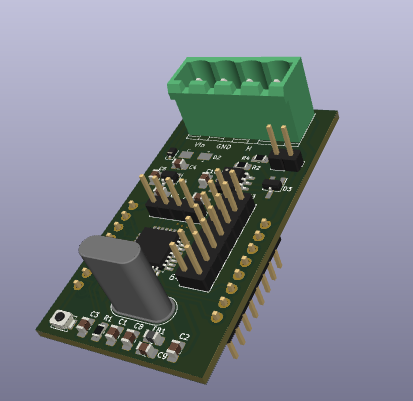

STM32-CAN-Bus-board
-------------------

This is an STM32F042K6T6 based board that can be used to build sensors that communicate over a CAN bus

All the pins of the STM32 that are not already used are available on the connectors

The available pins provide many peripherals (ADC, SPI, I2C, GPIO and more) that can be used for many projects (IOT sensors, security sensors, automation...)

# Kicad project

The Kicad project as been created with the version 8.0.1 of Kicad.

Most of the symbols and footprints comes from the default libraries.

The custom footprints are stored in the `custom` folder near the Kicad project.

# PCB Mounting instructions

Mounting the components:
1. Take the PCB and fix it to the table.
2. Put solder past on all CMS pads.
3. Configure your hot air machine with something like this:
- Speed: 3/8.
- Temperature: 300°C.
4. Solder the CMS components in this order: D4, D6, D1, D5, D2, U2, U3.
5. Solder the other components in this order: C1, C10, C4, R4, R2, R6, R3, R5, F1, Jumper, C6, C5, L1.
6. Mount the `NUCLEO-L432KC` board in the headers and solder the headers to the PCB (Doing it like this prevent issues with headers that are not perfectly vertical).
7. Remove the nucleo board from the soldered headers.

Configuration of the `NUCLEO-L432KC` board:
- Remove the jumper!
- Remove SB9.
- Remove SB14.

Testing instructions:
- Remove the `NUCLEO-L432KC` board from the headers.
- Power on the board with laboratory power supply configured at 12V with current limited to 50mA.
  - At this point the power consumption (on 12V line) should be less than 10mA.
  - Measure the voltage in the 3V3 pin and check that the voltage is around 3.3V.
- If the previous tests pass, turn off the power and plug the `NUCLEO-L432KC` board in the headers then turn on the power.
  - At this point the power consumption (on 12V line) should be less than 10mA.
- If the previous tests pass, connect the `NUCLEO-L432KC` board to the computer and flash it.
