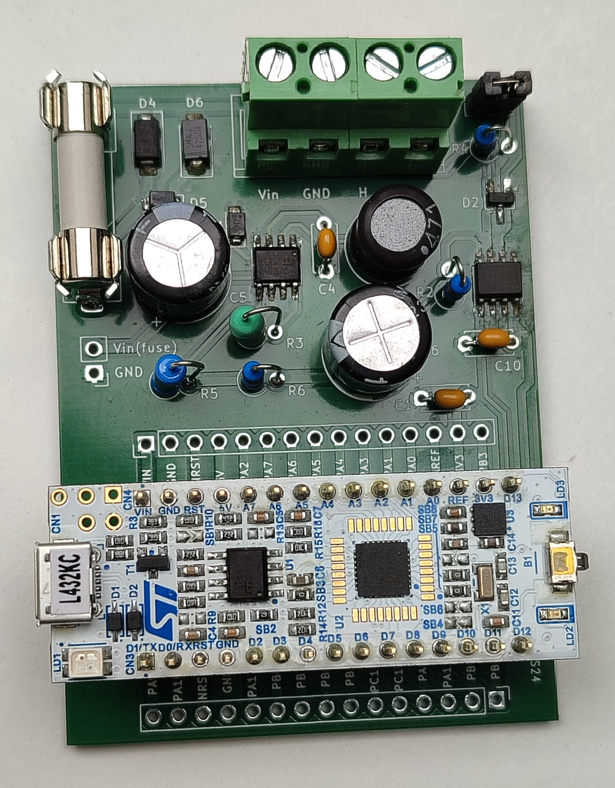
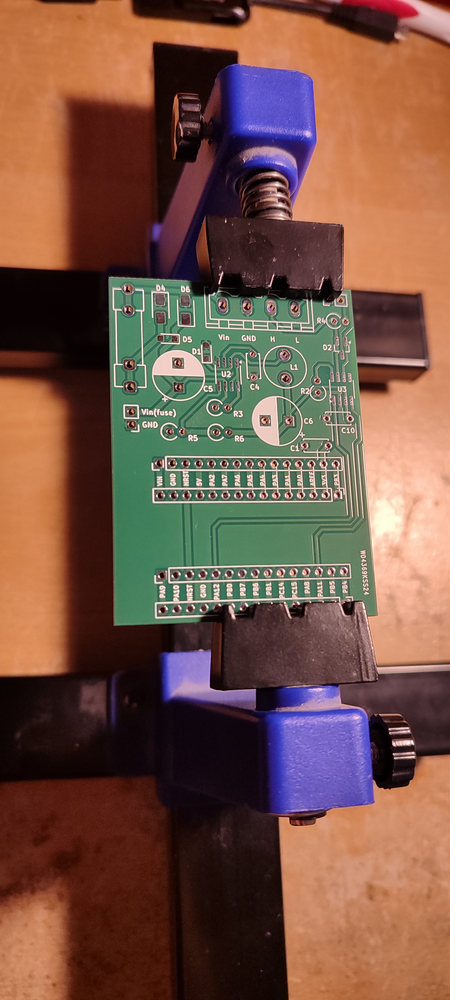

STM32-CAN-Bus-board
-------------------

CAN Bus shield with external power supply (12V/24V) for NUCLEO-L432KC board.

All the pins of the NUCLEO-L432KC board are available on the connectors of the shield.

The available pins provide many peripherals (ADC, SPI, I2C, GPIO and more) that can be used for many projects (IOT sensors, security sensors, automation...)



# Hardware

This part describe how the schematic was made, how to mount the PCB and how to test it.

**IMPORTANT: This shield require some modifications on the Nucleo board to works (due to external supply) (see after)**

## Kicad project

The Kicad project as been created with the version 8.0.1 of Kicad.

Most of the symbols and footprints comes from the default libraries.

The custom footprints are stored in the `custom` folder near the Kicad project.

Setup Kicad on Ubuntu 24.04:

```
sudo add-apt-repository ppa:kicad/kicad-8.0-releases
sudo apt update
sudo apt install kicad
```

## Configuration of the NUCLEO-L432KC board

Some modifications are required to be able to power the Nucleo board from external 3V3 regulator (provided by the shield):
- Remove the jumper!
- Remove SB9.
- Remove SB14.

After these changes:
- The 3V3 power for the STM32 will be provided by "external power source" (the shield).
- The debug/flash side of Nucleo board will not be powered by the "external power source" (the shield).
- To flash or debug the Nucleo board, the Nucleo board must be connected by USB to the computer (The St-Link chip will be powered by 5V>3V regulator in the Nucleo board) AND the 3V3 power must be supplied by the shield (to power the STM32 chip).

## PCB mounting instructions



Mount the components on the board:
1. Take the PCB and fix it to the table.
2. Put solder past on all CMS pads.
3. Configure your hot air machine with something like this:
- Speed: 3/8.
- Temperature: 300°C.
4. Solder the CMS components in this order: D4, D6, D1, D5, D2, U2, U3.
5. Solder the other components in this order: C1, C10, C4, R4, R2, R6, R3, R5, F1, Jumper, C6, C5, L1.
6. Mount the `NUCLEO-L432KC` board in the headers and solder the headers to the PCB (Doing it like this prevent issues with headers that are not perfectly vertical or parallel).
7. Remove the nucleo board from the soldered headers.

## PCB testing instructions

Testing instructions:
- Remove the `NUCLEO-L432KC` board from the headers.
- Power on the board with laboratory power supply configured at 12V with current limited to 50mA.
  - At this point the power consumption (on 12V line) should be less than 10mA.
  - Measure the voltage in the 3V3 pin and check that the voltage is around 3.3V.
- If the previous tests pass, turn off the power and plug the `NUCLEO-L432KC` board in the headers then turn on the power.
  - At this point the power consumption (on 12V line) should be less than 10mA.
- If the previous tests pass, connect the `NUCLEO-L432KC` board to the computer and flash it with the template project.
- Test the CAN interface:
  - Plug a USB<>CAN device from a Linux computer to the board.
  - On the computer, execute these commands:
```
sudo apt-get install can-utils
sudo modprobe vcan
sudo ip link add dev can0 type vcan
sudo ip link set up can0 type can bitrate 250000
candump -td -a can0
```
  - Reset the board
  - On the `candump` you should see something like this:
```
 (000.000000)  can0  71D   [1]  00                        '.'
```

# Software

This repository comes with a demo software in the `software` directory: This software act like a CANopen node and permits to control the LED of the `NUCLEO-L432KC` board.

This guide also describe how to create a project from scratch for the `STM32-CAN-Bus-board` board.

## Tools setup

1. Download and install `STM32CubeIDE` from [here](https://www.st.com/en/development-tools/stm32cubeide.html)
2. (Optional) Download and install `STM32CubeProg` from [here](https://www.st.com/en/development-tools/stm32cubeprog.html). (This tool can be used to only flash the `NUCLEO-L432KC` board without the IDE)

### Compatibility issues of STM32CubeIDE with Ubuntu 24.04

There are issues with `STM32CubeIDE` on `Ubuntu 24.04` because it has a dependecy to `libncurses5` and this is not available with this version of Ubuntu.

This dependency is required by the `arm-none-eabi-gdb` provided by ST.

To resolve the problem:
- Install the generic linux version of `STM32CubeIDE` instead of the version from `.deb` (as it will not check the dependency).
- Install `arm-none-eabi-gdb` or `gdb-multiarch` and create a link to provide `arm-none-eabi-gdb`:
```
sudo apt install gdb-multiarch
sudo ln -s /usr/bin/gdb-multiarch /usr/bin/arm-none-eabi-gdb
```
- In your project configuration `Project Properties -> C/C++ Build -> Environment -> PATH` add `/usr/bin` at the first place to use `arm-none-eabi-gdb` provided by `/usr/bin` instead of ST directories.

## Create a project from scratch

Base project creation:
1. Open `STM32CubeIDE`.
2. Press `File > New > STM32 Project`.
3. Press `Board Selector`.
4. Search `Commercial Part Number` with `NUCLEO-L432KC`, then select it and press Next
5. Specify the `Project Name` and `Location`, then press `Finish`.
6. Configure the peripheral in defaults state and open the configuration tool (or open `.ioc` file).
7. Change the configuration of `PA0` to `Reset_State` as we don't have MCO clock source when the `NUCLEO-L432KC` is externaly powered from 3V3 (because MCO comes from the St-Link chip and it is not powered in this situation).
8. In `Clock Configuration`:
- Select `System Clock Mux` to use `PLLCLK`
- Select `PLL Source Mux` to `MSI`
- Configure the PLL with `X48` and `/4` to get 48Mhz in SYSCLK and APBs

For the integration of `CANopenNode` stack see the README of [CanOpenSTM32](https://github.com/CANopenNode/CanOpenSTM32):
1. From configuration tool configure the CAN interface:
- Activate `CAN1`
- Activate all the interrupts of `CAN1`
- Enable `Automatic Bus-Off Management`
- Enable `Automatic Wake-Up Mode`
- Enable `Automatic Retransmission`
- Configure the Bit timing parameters, you can use [this generator](http://www.bittiming.can-wiki.info/). The clock for `CAN1` is `APB1` (datasheet). In my case with a clock of 48Mhz and desired bitrate of 250Kbit/s I set:
  - Prescaler: 12
  - Time Quanta in Bit Segment 1: 13 Times
  - Time Quanta in Bit Segment 2: 2 Times
2. From configuration tool configure a timer for `CANopenNode` stack:
- Activate `TIM16`
- Enable the interrupt of `TIM16`
- Configure `TIM16` to get 1ms. Note that `TIM16` use `APB2` clock. In my case with a clock of 48Mhz I set:
  - Prescaler (PSC - 16 bits value): 48-1
  - Counter Period (AutoReload Register - 16 bits value ): 1000-1
3. Clone `CanOpenSTM32` somewhere in your computer [see here](https://github.com/CANopenNode/CanOpenSTM32)
4. Take `CANopenNode` and `CANopenNode_STM32` directories from the cloned repo and copy that in your project (from the IDE)
5. Add `CANopenNode` and `CANopenNode_STM32` to `Source locations` in `Project Properties -> C/C++ General -> Paths and Symbols -> Source Locations`. Then add an exclusion filter for `example/` folder for `CANopenNode` folder
6. Add `CANopenNode` and `CANopenNode_STM32` to `Project Properties -> C/C++ General -> Paths and Symbols -> Includes` under `GNU C` items
7. In your `main.c`, add `#include "CO_app_STM32.h"`:
```
/* Private includes ----------------------------------------------------------*/
/* USER CODE BEGIN Includes */
#include "CO_app_STM32.h"
/* USER CODE END Includes */
```
8. In the `main.c` file, call `canopen_app_interrupt()` when the timer ticks at 1ms:
```
/* USER CODE BEGIN 4 */
void HAL_TIM_PeriodElapsedCallback(TIM_HandleTypeDef *htim) {
	  // Handle CANOpen app interrupts
	  if (htim == canopenNodeSTM32->timerHandle) {
	      canopen_app_interrupt();
	  }
}
/* USER CODE END 4 */
```
9. In the `main.c` file, configure the `CANopenNode` stack and call the `canopen_app_process()` function in the main loop:
```
int main(void)
{
  // ...

  /* Initialize all configured peripherals */
  // ...
  /* USER CODE BEGIN 2 */
  CANopenNodeSTM32 canOpenNodeSTM32;
  canOpenNodeSTM32.CANHandle = &hcan1;
  canOpenNodeSTM32.HWInitFunction = MX_CAN1_Init;
  canOpenNodeSTM32.timerHandle = &htim16;
  canOpenNodeSTM32.desiredNodeID = 20;
  canOpenNodeSTM32.baudrate = 250;
  canopen_app_init(&canOpenNodeSTM32);
  /* USER CODE END 2 */

  /* Infinite loop */
  /* USER CODE BEGIN WHILE */
  while (1)
  {
    /* USER CODE END WHILE */

    /* USER CODE BEGIN 3 */
	  canopen_app_process();
  }
  /* USER CODE END 3 */
}
```
10. Flash the board and execute the CAN tests described in `PCB testing instructions`.

## Configure the object dictionary

1. Find the last release of `CANopenEditor` and download the binaries [link](https://github.com/CANopenNode/CANopenEditor/releases)
2. Extract the release binary archive
3. Open `EDSEditor.exe` with wine:
```
wine net481/EDSEditor.exe
```
4. Open the file `CANopenNode_STM32/DS301_profile.xpd`

## CANopenLinux

CANopenLinux can be used as a gateway to communicate with CANopen devices using socket/stdio commands.

Setup the CAN interface:
```
sudo apt-get install can-utils
sudo modprobe vcan
# Do it only if can0 is not already mounted!
#sudo ip link add dev can0 type vcan
sudo ip link set up can0 type can bitrate 250000
```

Download and install CANopenLinux:
```
git clone https://github.com/CANopenNode/CANopenLinux.git
cd CANopenLinux
git submodule update --init --recursive
make
```

Read an OD entry from the computer:
```
./canopend can0 -i 1 -c "stdio"
20 r 0x1000 0
[0] 34 12 00 00
```

Write an OD entry from the computer:
```
./canopend can0 -i 1 -c "stdio"
20 w 0x6001 0 U32 0
[0] OK
```

_In my example, 0x6001 controls the LED!_

